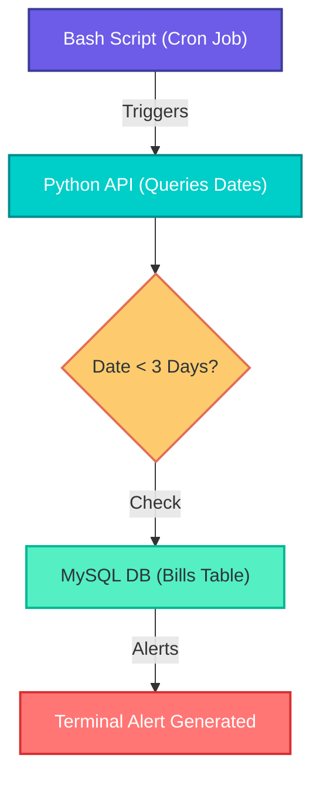

# Family Support Scheduler 
Remittance isn't just about sending money; it's about fulfilling obligations. Migrant
workers frequently need to ensure specific bills back home (like rent, school tuition, or medical
bills) are paid on strict deadlines. Missing a date can have severe consequences.

---

## Objective
- Build a calendar-based scheduling tool specifically designed for
recurring family bills
- It allows users to: -
    - log upcoming expenses
    - categorize them
    - set strict due dates
    - manage their status (Paid vs. Unpaid)

---

## Functional Requirements
- Users log upcoming bills with strict due dates and Paid/Unpaid states.
- Bash script triggers backend API to alert for unpaid bills due in < 3 days.

---

## Tech stack
- Frontend: JavaScript (React Native), HTML5, CSS3.
- Backend: Python 3.10.20 (FastAPI v0.135.3).
- Database: MySQL (8.0.45)
- Automation: Native Linux Bash shell scripting

---

## Data Flow Architecture

---
