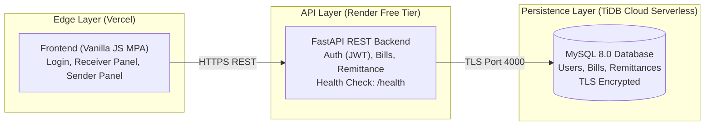

# Family Support Scheduler 🗓️💸

A calendar-based scheduling and remittance platform designed for recurring family bills. It allows beneficiaries to log, track, and manage their expenses, while allowing senders to view these obligations and fulfill them directly via stablecoin remittance.

---

## 🌐 Production Deployments (100% Free Tier)

| Service | Platform | Live URL / Endpoint | Tier / Specs |
| :--- | :--- | :--- | :--- |
| **Frontend Web App** | **Vercel** | [https://frontend-two-hazel-16.vercel.app](https://frontend-two-hazel-16.vercel.app) | Hobby (Free Edge CDN, Global SSL) |
| **Backend REST API** | **Render** | [https://family-scheduler-api.onrender.com](https://family-scheduler-api.onrender.com) | Free Web Service (Auto-sleeps on idle) |
| **Interactive API Docs** | **Render (Swagger)** | [https://family-scheduler-api.onrender.com/docs](https://family-scheduler-api.onrender.com/docs) | OpenAPI 3.0 Interactive Explorer |
| **API Health Check** | **Render** | [https://family-scheduler-api.onrender.com/health](https://family-scheduler-api.onrender.com/health) | Liveness Indicator (`{"message": "backend is live"}`) |
| **Database Pool Health** | **Render / TiDB** | [https://family-scheduler-api.onrender.com/health/db](https://family-scheduler-api.onrender.com/health/db) | Database Pool Indicator (`{"status": "connected", "result": 1}`) |
| **Cloud Database** | **TiDB Cloud** | `gateway01.ap-southeast-1.prod.aws.tidbcloud.com:4000` | Serverless (5 GB Free Forever, MySQL 8.0 over TLS) |
| **Automated CI/CD** | **GitHub Actions** | `.github/workflows/` | Automated tests, secret scanning & rollbacks |

### 🔑 Pre-seeded Demo Accounts
Test the live deployment immediately with pre-configured accounts:
| Role | Username | Password | Access / Capabilities |
| :--- | :--- | :--- | :--- |
| **Beneficiary** | `bob_beneficiary` | `password123` | Log upcoming expenses, manage recurring bills, view status |
| **Sender** | `alice_sender` | `password123` | View family obligations and remit payments |

> [!NOTE]
> **Free Tier Cold Starts**: Render's free tier automatically spins down web services after 15 minutes of inactivity. If the service is asleep, the first request may take ~30–45 seconds while the container boots up. Subsequent requests respond instantly.

---

## 🏗️ Architecture

The application is built on a clean decoupled architecture:


```mermaid
flowchart LR
    subgraph "Edge Layer (Vercel)"
        FE["Frontend (Vanilla JS MPA)<br/>Login, Receiver Panel, Sender Panel"]
    end

    subgraph "API Layer (Render Free Tier)"
        BE["FastAPI REST Backend<br/>Auth (JWT), Bills, Remittance<br/>Health Check: /health"]
    end

    subgraph "Persistence Layer (TiDB Cloud Serverless)"
        DB[("MySQL 8.0 Database<br/>Users, Bills, Remittances<br/>TLS Encrypted")]
    end

    FE -->|HTTPS REST| BE
    BE -->|TLS Port 4000| DB
```

1. **Frontend (Vercel)**: High-performance Multi-Page Application (MPA) in Vanilla JS, HTML, and CSS. Routed into unified login, `receiver_panel` for beneficiaries, and `sender_panel` for senders.
2. **Backend (Render)**: Asynchronous FastAPI service providing authenticated endpoints for user authentication, bill lifecycle management, and remittance processing.
3. **Database (TiDB Cloud Serverless)**: Fully managed, 100% MySQL 8.0 wire-compatible cloud database with native TLS encryption on port 4000.

---

## 🛡️ Security & Secret Protection

- **Zero Hardcoded Secrets**: Secrets and keys are strictly injected via environment variables. If unconfigured in local sandbox environments, the system falls back to cryptographically secure OS PRNG tokens (`secrets.token_hex(32)`) with explicit warning logs.
- **Git Protection**: `.gitignore` recursively ignores all `.env`, `.env.*`, certificates (`*.pem`, `*.key`), and sensitive credential folders.
- **Template Provided**: `.env.example` contains safe sample placeholders for all required environment variables.
- **Pre-Merge Secret Scanning**: The GitHub Actions CI pipeline performs automated secret detection, blocking any commits containing private keys or credentials.
- **CORS Protection**: FastAPI CORS middleware strictly restricts origins to localhost in development and trusted production domains (`*.vercel.app`) with custom override via `ALLOWED_ORIGINS`.

---

## 🚀 Getting Started Locally

### Prerequisites
- Python 3.11+
- MySQL 8.0 (Local instance or TiDB Cloud Serverless)
- Conda or Python venv

### 1. Configure Environment
Copy the sample template to `.env`:
```bash
cp .env.example .env
```
Update `.env` with your database credentials and secret key:
```env
DB_HOST=127.0.0.1
DB_PORT=3306
DB_USER=root
DB_PASSWORD=your_password
DB_NAME=family_supp_sche
DB_TABLE=bills
DB_SSL=false
JWT_SECRET_KEY=e83a9f4c71b6205e48d39f21aa47bc95de2c6104f7b24981cae9352e8d076a14
JWT_ALGORITHM=HS256
JWT_EXPIRE_MINUTES=480
ALLOWED_ORIGINS=http://localhost:8003,http://127.0.0.1:8003,https://frontend-two-hazel-16.vercel.app
```

### 2. Initialize Database
For local MySQL:
```bash
mysql -u root -p < database/schema.sql
mysql -u root -p < database/sample-data.sql
```
For TiDB Cloud Serverless:
```bash
python scripts/init_cloud_db.py
```

### 3. Start Backend & Frontend
Using Makefile:
```bash
# Start backend API (http://127.0.0.1:8000)
make start-backend

# Start frontend (http://127.0.0.1:8003/login/login.html)
make start-frontend
```

---

## 🧪 Testing & Code Quality

The codebase enforces strict code quality and formatting via **Ruff** and comprehensive test coverage via **Pytest**:

```bash
# Run Ruff lint check
ruff check .

# Check code formatting
ruff format --check .

# Run all 33 unit and integration tests
PYTHONPATH=backend pytest tests/ -v
```

---

## ☁️ Deployment Instructions

### 1. Database (TiDB Cloud Serverless)
1. Sign up for free at [tidbcloud.com](https://tidbcloud.com) (No credit card required).
2. Create a free **Serverless Cluster**.
3. Create the database: `CREATE DATABASE family_supp_sche;`.
4. Run `python scripts/init_cloud_db.py` to create all tables over TLS.

### 2. Backend (Render Free Tier)
Deploy using either the automated CLI script or the Render dashboard:

- **Option A (Automated CLI via REST API)**:
  ```bash
  # Securely reads API key from ~/.secrets/render_api.txt
  python scripts/deploy_render.py
  ```
- **Option B (Render Dashboard Blueprint)**:
  1. In the [Render Dashboard](https://dashboard.render.com), click **New + $\rightarrow$ Blueprint**.
  2. Select your repository. Render will automatically read [render.yaml](render.yaml).
  3. Enter your TiDB credentials when prompted (`DB_HOST`, `DB_PORT=4000`, `DB_USER`, `DB_PASSWORD`, `DB_SSL=true`).
  4. Click **Apply**. Render will deploy the API to `https://family-scheduler-api.onrender.com`.

### 3. Frontend (Vercel Hobby Tier)
Deploy using either the Vercel CLI or Web Dashboard:

- **Option A (Vercel CLI)**:
  ```bash
  cd frontend
  npx vercel --prod
  ```
- **Option B (Vercel Web Dashboard)**:
  1. In the [Vercel Dashboard](https://vercel.com), click **Add New... $\rightarrow$ Project**.
  2. Import the repository and set **Root Directory** to `frontend`.
  3. Vercel will automatically detect [frontend/vercel.json](frontend/vercel.json) for edge headers and routing.
  4. Click **Deploy**. Your frontend is live globally with instant SSL at `https://frontend-two-hazel-16.vercel.app`!

---

## 🔄 Automated CI/CD & Rollbacks

GitHub Actions workflows are located in `.github/workflows/`:

- **CI Workflow (`ci.yml`)**: Runs on every pull request and push to `main`:
  1. Secret & credential leak detection.
  2. Ruff lint & formatting validation.
  3. Pytest test suite (33 tests).
- **CD & Automated Rollback (`deploy.yml`)**: Runs upon successful CI on `main`:
  1. Triggers Render deployment hook.
  2. Polls `/health` for up to 180s.
  3. **Automated Rollback**: If health check fails, automatically reverts Render to the previous stable deploy ID.
  4. Deploys frontend to Vercel production edge and smoke-tests `/login/login.html`.
  5. **Automated Rollback**: If edge smoke test fails, automatically reverts the Vercel production deployment.
- **Manual Rollback Dispatch (`manual_rollback.yml`)**: Allows 1-click on-demand rollback for Render, Vercel, or both directly from the GitHub Actions UI.

---

## 📋 API Reference

| Method | Endpoint | Description | Auth Required |
| :--- | :--- | :--- | :--- |
| `GET` | `/health` | Service liveness indicator | None |
| `GET` | `/health/db` | Database connection pool probe | None |
| `POST` | `/auth/register` | Register new user (`sender` or `beneficiary`) | None |
| `POST` | `/auth/login` | Login and receive JWT bearer token | None |
| `GET` | `/bills` | List bills (filter upcoming/expired) | Bearer Token |
| `POST` | `/bills` | Create new bill | Beneficiary Role |
| `GET` | `/bills/search` | Search bills by name | Bearer Token |
| `PUT` | `/bills/{bill_id}` | Update bill payment status | Bearer Token |
| `DELETE` | `/bills/{bill_id}` | Soft-delete a bill | Beneficiary Role |
| `POST` | `/remittance/pay` | Pay a bill via stablecoin remittance | Sender Role |
| `GET` | `/remittance/history/{user_id}` | View remittance history | Sender Role |

---

## 📄 License
This project is licensed under the [MIT License](LICENSE).