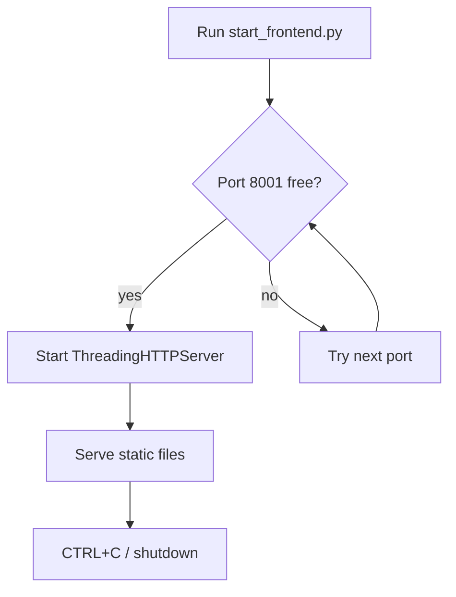
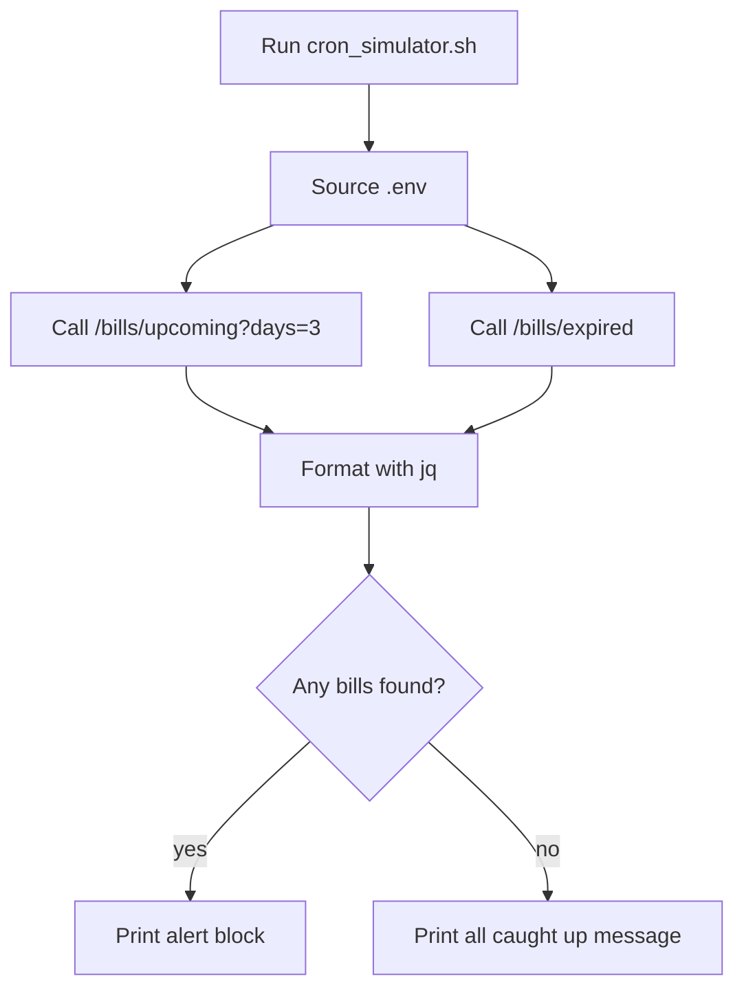

# Automation Flow Digrams

## Frontend Server Flow

```mermaid
flowchart TD
  A[Run start_frontend.py] --> B{Port 8001 free?}
  B -- yes --> C[Start ThreadingHTTPServer]
  B -- no --> D[Try next port]
  D --> B
  C --> E[Serve static files]
  E --> F[CTRL+C / shutdown]
```

## Alert Script Flow

```mermaid
flowchart TD
  A[Run cron_simulator.sh] --> B[Source .env]
  B --> C[Call /bills/upcoming?days=3]
  B --> D[Call /bills/expired]
  C --> E[Format with jq]
  D --> E
  E --> F{Any bills found?}
  F -- yes --> G[Print alert block]
  F -- no --> H[Print all caught up message]
```

## Notes
These diagrams should stay aligned to the real script entry points, not hypothetical background jobs.