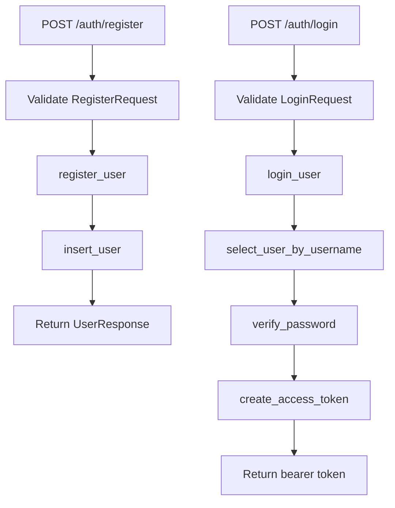
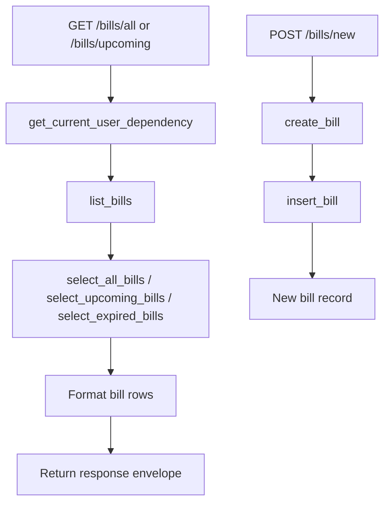
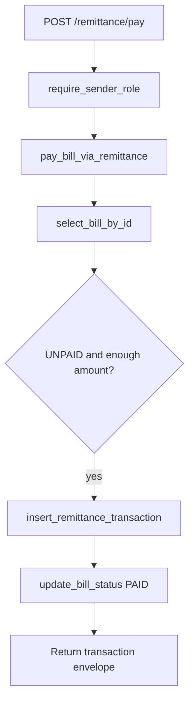

# Backend Flow Digrams

## Auth Flow

```mermaid
flowchart TD
  A[POST /auth/register] --> B[Validate RegisterRequest]
  B --> C[register_user]
  C --> D[insert_user]
  D --> E[Return UserResponse]

  F[POST /auth/login] --> G[Validate LoginRequest]
  G --> H[login_user]
  H --> I[select_user_by_username]
  I --> J[verify_password]
  J --> K[create_access_token]
  K --> L[Return bearer token]
```

## Bill Flow

```mermaid
flowchart TD
  A[GET /bills/all or /bills/upcoming] --> B[get_current_user_dependency]
  B --> C[list_bills]
  C --> D[select_all_bills / select_upcoming_bills / select_expired_bills]
  D --> E[Format bill rows]
  E --> F[Return response envelope]

  G[POST /bills/new] --> H[create_bill]
  H --> I[insert_bill]
  I --> J[New bill record]
```

## Remittance Flow

```mermaid
flowchart TD
  A[POST /remittance/pay] --> B[require_sender_role]
  B --> C[pay_bill_via_remittance]
  C --> D[select_bill_by_id]
  D --> E{UNPAID and enough amount?}
  E -- yes --> F[insert_remittance_transaction]
  F --> G[update_bill_status PAID]
  G --> H[Return transaction envelope]
```

## Notes
Keep each diagram aligned to one endpoint group so the request path stays easy to trace.