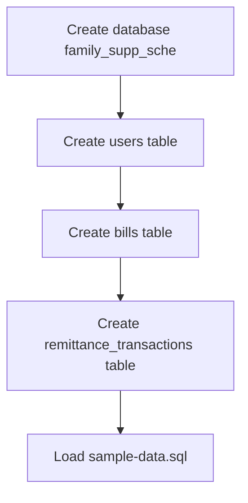
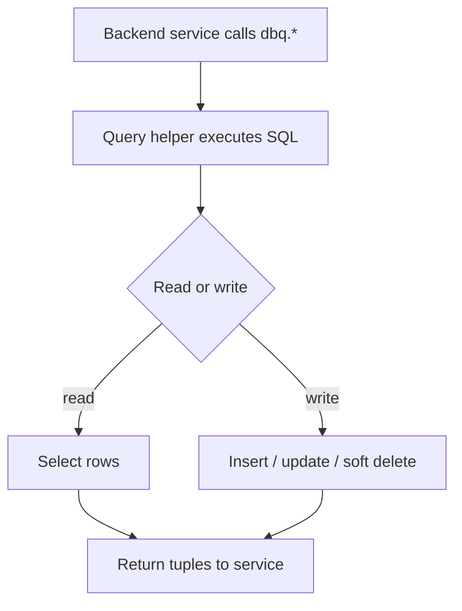

# Database Flow Digrams

## Setup Flow

```mermaid
flowchart TD
  A[Create database family_supp_sche] --> B[Create users table]
  B --> C[Create bills table]
  C --> D[Create remittance_transactions table]
  D --> E[Load sample-data.sql]
```

## Runtime Flow

```mermaid
flowchart TD
  A[Backend service calls dbq.*] --> B[Query helper executes SQL]
  B --> C{Read or write}
  C -- read --> D[Select rows]
  C -- write --> E[Insert / update / soft delete]
  D --> F[Return tuples to service]
  E --> F
```

## Notes
Keep the diagrams focused on schema setup and the query layer, not the route-level business rules.