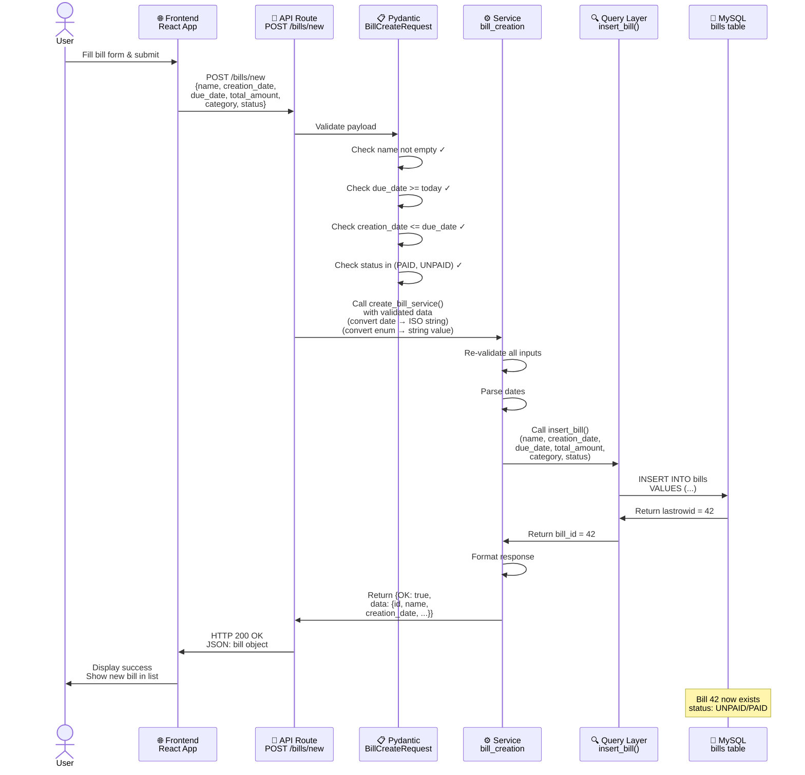
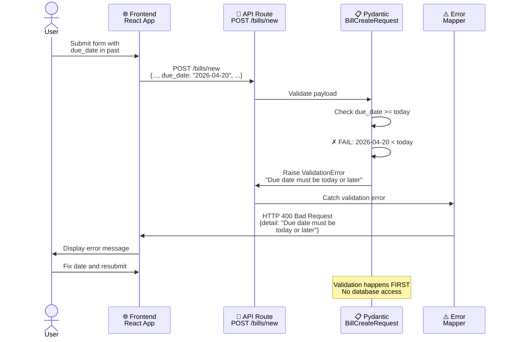
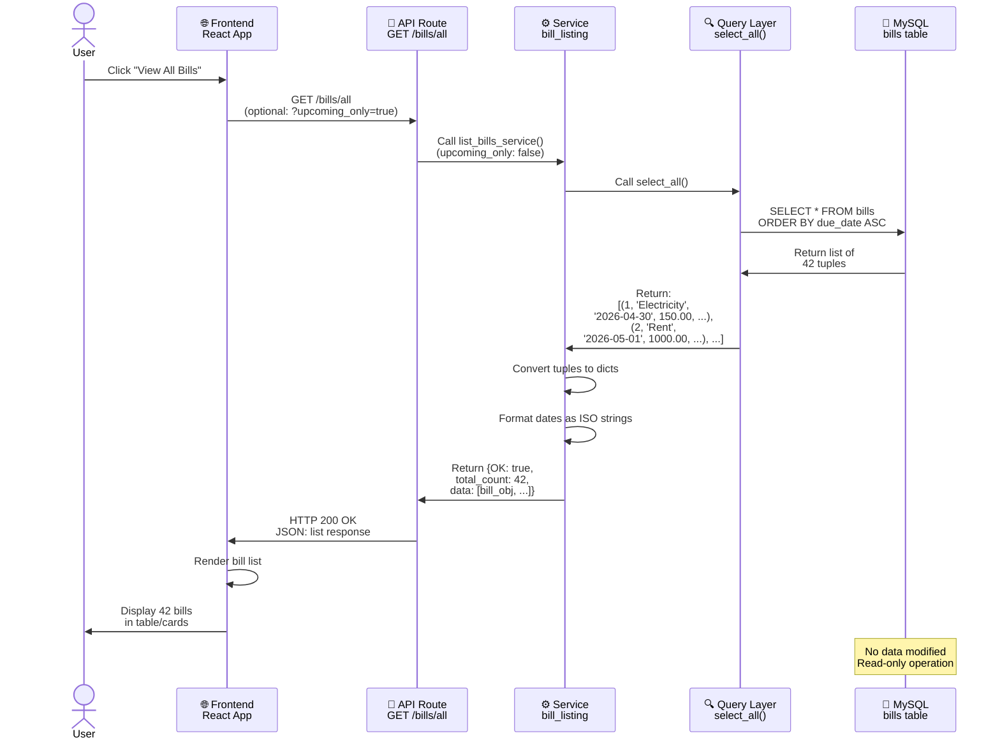
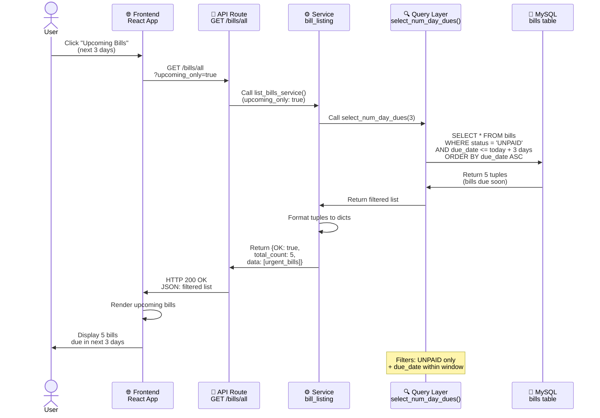
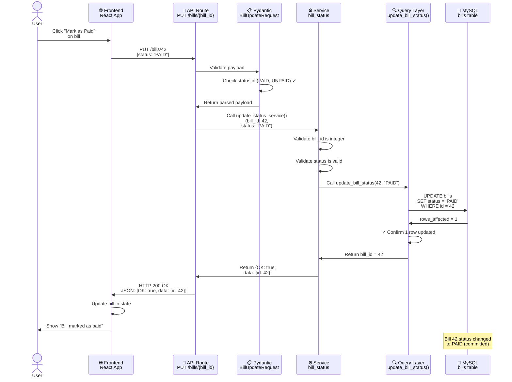
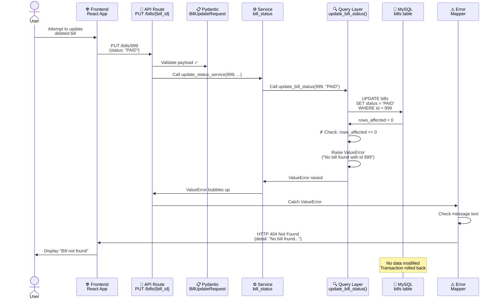
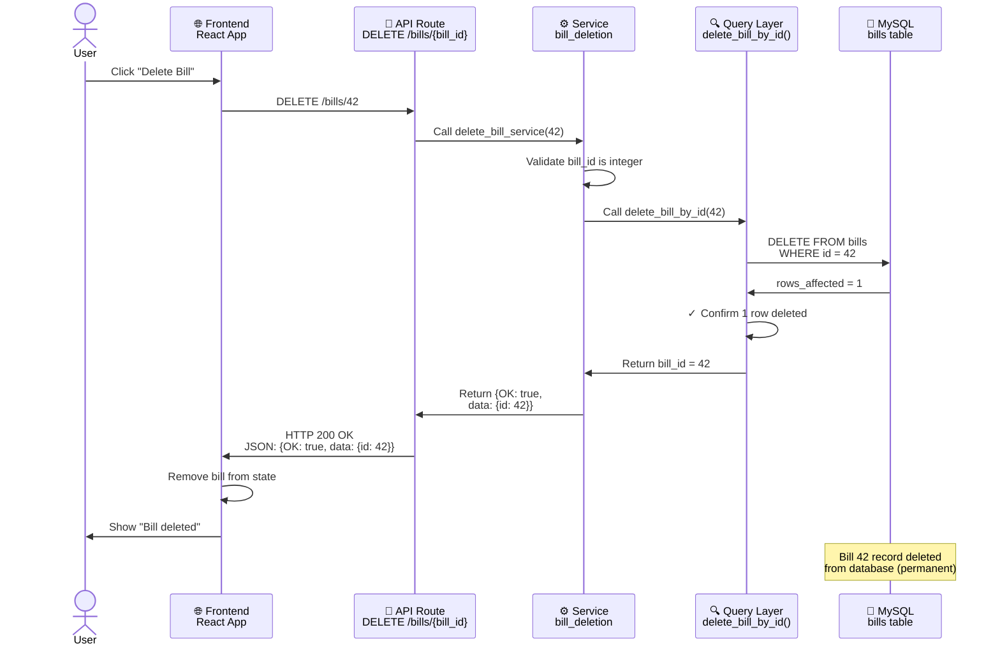
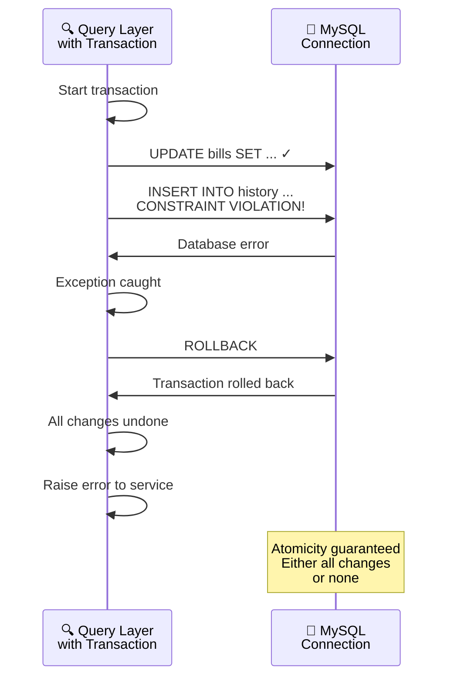

# Bill Scheduler - Full-Stack Sequence Diagrams

## Overview

This document describes the sequence of interactions between frontend, backend layers, and database for all major operations in the Bill Scheduler application.

---

## Diagram Legend

- **Frontend:** React UI application in browser
- **API Routes:** HTTP endpoint layer (api_endpoints.py)
- **Schemas:** Pydantic request/response validation (schemas.py)
- **Services:** Business logic and validation (services/)
- **Queries:** Direct SQL execution (queries.py)
- **Database:** MySQL bill storage

All communications include both success and error paths.

---

## Sequence 1: Create Bill (Happy Path)



---

## Sequence 2: Create Bill (Validation Error)



---

## Sequence 3: List Bills (Happy Path)



---

## Sequence 4: List Bills with Upcoming Filter



---

## Sequence 5: Update Bill Status (Happy Path)



---

## Sequence 6: Update Bill Status (Bill Not Found)



---

## Sequence 7: Delete Bill (Happy Path)



---

## Sequence 8: Transaction & Rollback (Database Error)



---

## Request/Response Format Examples

### POST /bills/new - Request
```json
{
  "name": "Electricity Bill",
  "creation_date": "2026-04-24",
  "due_date": "2026-05-10",
  "total_amount": 150.50,
  "category": "Utilities",
  "status": "UNPAID"
}
```

### POST /bills/new - Response (200 OK)
```json
{
  "OK": true,
  "data": {
    "id": 42,
    "name": "Electricity Bill",
    "creation_date": "2026-04-24",
    "due_date": "2026-05-10",
    "total_amount": 150.50,
    "category": "Utilities",
    "status": "UNPAID",
    "created_at": "2026-04-24T14:30:22.123456"
  }
}
```

### PUT /bills/{bill_id} - Request
```json
{
  "status": "PAID"
}
```

### PUT /bills/{bill_id} - Response (200 OK)
```json
{
  "OK": true,
  "data": {
    "id": 42
  }
}
```

### Error Response (400 Bad Request)
```json
{
  "detail": "Due date must be today or later"
}
```

### Error Response (404 Not Found)
```json
{
  "detail": "No bill found with that id"
}
```

---

## Layer Interaction Summary

| Layer | Responsibility | Input | Output | Error Handling |
|-------|---|---|---|---|
| Frontend (React) | UI rendering, user interaction | User clicks/input | HTTP requests | Display error messages |
| API Routes | HTTP mapping, error translation | HTTP request + Pydantic validation | HTTP response + status code | ValueError → 404, Other ValueError → 400, Exception → 500 |
| Schemas (Pydantic) | Request validation | Raw JSON payload | Typed objects (date, enum) | ValidationError → 400 |
| Services | Business logic, input re-validation | Typed objects OR strings | Response dict/bool | ValueError → caught by routes |
| Queries | Raw SQL execution, transaction management | Parameters | Rows/rowcount | Database errors → ValueError/Exception |
| Database | Data persistence | SQL statements | Result sets | SQL constraint violations |

---

## Key Design Patterns

### 1. Validation at Multiple Layers
- **Schema Layer:** Catches type/format errors early (400 before service runs)
- **Service Layer:** Re-validates business logic (ensures safety if service called directly)
- **Query Layer:** Confirms rowcount for UPDATE/DELETE (ensures operations succeeded)

### 2. Error Translation
- **Query Layer:** Raises ValueError with descriptive message on row not found
- **Service Layer:** Lets ValueError bubble up (validation errors)
- **Route Layer:** Maps ValueError with "No bill found" to 404, others to 400

### 3. Type Adaptation at Route Layer
- Converts Pydantic `date` objects to ISO strings for services
- Converts Pydantic `enum` values to string values for services
- Maintains backwards compatibility with existing service implementations

### 4. Atomicity Guarantees
- Each transaction either commits all changes or rolls back all
- Connection pool ensures transaction isolation
- rowcount validation prevents silent failures

---

## Summary

The full-stack sequence shows:
1. **Frontend → API:** User action triggers HTTP request with JSON payload
2. **API → Schema:** Pydantic validates types, formats, enums before processing
3. **API → Service:** Validated data passed to business logic layer
4. **Service → Query:** Business logic calls raw SQL layer with parameters
5. **Query → DB:** SQL executes in transaction, rowcount validated
6. **DB → Query:** Result set or error returned
7. **Query → Service:** Result formatted and returned
8. **Service → API:** Response prepared
9. **API → Frontend:** HTTP response with status code and JSON payload
10. **Frontend → User:** UI updated with success/error message

All layers are loosely coupled, with clear contracts (request/response formats) and comprehensive error handling at each level.
