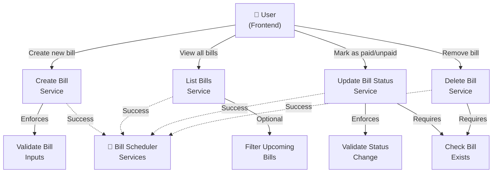
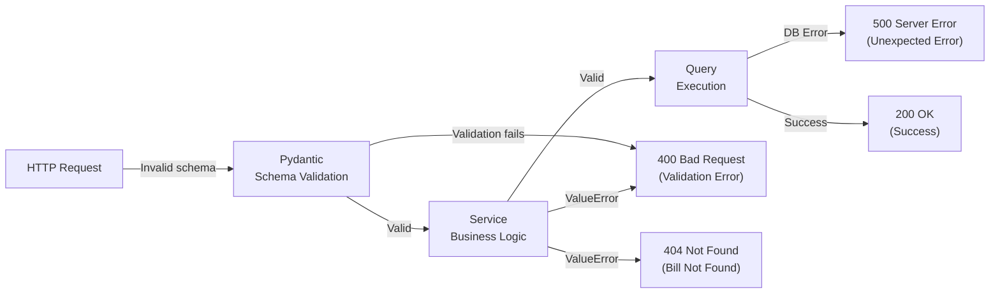

# Bill Scheduler - Use Case Diagrams

## Overview

This document describes the use cases supported by the Family Bill Scheduler backend services. Each service exposes one or more use cases that the frontend can invoke.

---

## Primary Use Cases Diagram

---

## Detailed Use Cases

### UC-1: Create Bill

**Actor:** Frontend User

**Description:** User creates a new bill entry with all required information.

**Main Flow:**
1. User submits bill form with: name, creation_date, due_date, total_amount, category, status
2. System validates all inputs:
   - name: non-empty after trimming
   - creation_date: required, must be ≤ due_date
   - due_date: required, must be ≥ today
   - total_amount: numeric value
   - category: string
   - status: must be PAID or UNPAID
3. System inserts bill into database
4. System returns newly created bill with auto-generated id and timestamp

**Alternative Flows:**
- **A1 - Validation Error (name empty):** System returns 400 "Bill name cannot be empty"
- **A2 - Date Validation Error (due_date in past):** System returns 400 "Due date must be today or later"
- **A3 - Date Logic Error (creation_date > due_date):** System returns 400 "Creation date cannot be after due date"
- **A4 - Database Error:** System returns 500 with error details

**Preconditions:**
- User is connected to frontend
- Database connection is available
- API server is running

**Postconditions:**
- Bill record created in database
- Frontend receives bill id and all details including created_at timestamp

---

### UC-2: List Bills

**Actor:** Frontend User

**Description:** User retrieves all bills or filters to upcoming bills only.

**Main Flow:**
1. User requests to see all bills
2. System retrieves all bills from database
3. System formats bills as JSON with all fields
4. System returns list with metadata (total_count)

**Alternative Flow - UC-2B: List Upcoming Bills Only**
1. User requests upcoming bills (filter parameter: upcoming_only=true)
2. System filters UNPAID bills with due_date ≤ current_date + 3 days
3. System formats filtered bills as JSON
4. System returns filtered list with metadata (total_count)

**Error Cases:**
- **E1 - Database Connection Error:** System returns 500 "Database error occurred"

**Preconditions:**
- Database contains at least 0 bills (empty list is valid)
- API server is running

**Postconditions:**
- Frontend receives list of bills (can be empty)
- Frontend displays bills or "no bills" message

---

### UC-3: Update Bill Status

**Actor:** Frontend User

**Description:** User changes a bill's status between PAID and UNPAID.

**Main Flow:**
1. User selects bill and chooses new status (PAID or UNPAID)
2. System validates:
   - Bill id exists in database
   - Status is valid enum value (PAID or UNPAID)
3. System updates bill's status field
4. System returns confirmation with bill id and new status

**Error Cases:**
- **E1 - Bill Not Found:** System returns 404 "No bill found with that id"
- **E2 - Invalid Status:** System returns 400 "Status must be PAID or UNPAID"
- **E3 - Database Error:** System returns 500 with error details

**Preconditions:**
- Bill exists in database
- Status value is valid

**Postconditions:**
- Bill status field updated in database
- Frontend receives updated bill data

---

### UC-4: Delete Bill

**Actor:** Frontend User

**Description:** User permanently removes a bill from the system.

**Main Flow:**
1. User selects bill and confirms deletion
2. System validates:
   - Bill id exists in database
3. System deletes bill record from database
4. System returns confirmation with deleted bill id

**Error Cases:**
- **E1 - Bill Not Found:** System returns 404 "No bill found with that id"
- **E2 - Database Error:** System returns 500 with error details

**Preconditions:**
- Bill exists in database
- User intends to permanently remove the bill

**Postconditions:**
- Bill record removed from database
- Frontend removes bill from UI
- Bill id is no longer valid for other operations

---

## Service-to-Use-Case Mapping

| Service | HTTP Method | Use Case | Input | Output |
|---------|-------------|----------|-------|--------|
| bill_creation | POST /bills/new | UC-1: Create Bill | BillCreateRequest | BillResponse |
| bill_listing | GET /bills/all | UC-2: List Bills | (optional) upcoming_only | BillListResponse |
| bill_status | PUT /bills/{bill_id} | UC-3: Update Status | BillUpdateRequest | BillResponse |
| bill_deletion | DELETE /bills/{bill_id} | UC-4: Delete Bill | bill_id (path param) | {OK, data: {id}} |

---

## Validation Rules Summary

### At Request Layer (Pydantic Schemas)
- **BillCreateRequest:**
  - name: str, required, non-empty after strip
  - creation_date: date, required, must be ≤ due_date
  - due_date: date, required, must be ≥ today
  - total_amount: float, required
  - category: str, required
  - status: BillStatus enum, required (PAID or UNPAID)

- **BillUpdateRequest:**
  - status: BillStatus enum, required (PAID or UNPAID)

### At Service Layer
- Input validation with meaningful error messages
- Business logic constraints (date comparisons)
- Error translation to ValueError for HTTP mapping

### At Query Layer
- rowcount validation on UPDATE/DELETE to confirm record affected
- Raises error if update/delete affects 0 rows

---

## Error Handling Flow

---

## Summary

The Bill Scheduler system provides four core use cases:
1. **Create** - Accepts structured bill data with full validation
2. **List** - Returns all bills with optional upcoming filter
3. **Update** - Modifies bill status with existence check
4. **Delete** - Removes bill permanently with existence check

All use cases enforce strict validation at multiple layers (schema, service, query) and return clear HTTP status codes for success and various error conditions.
