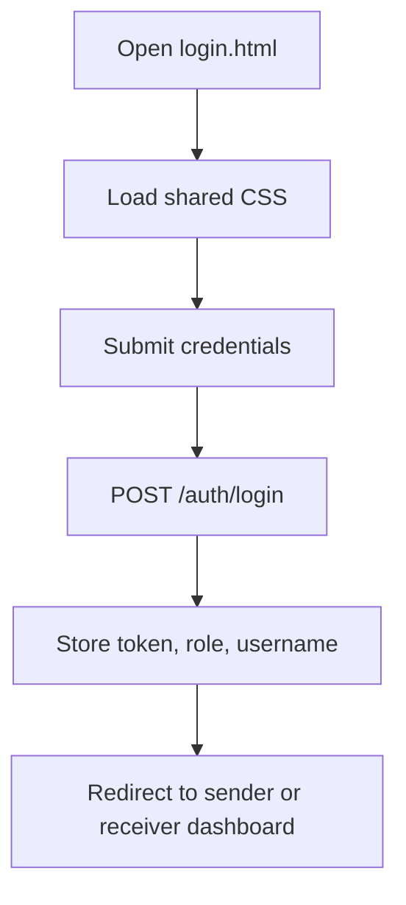
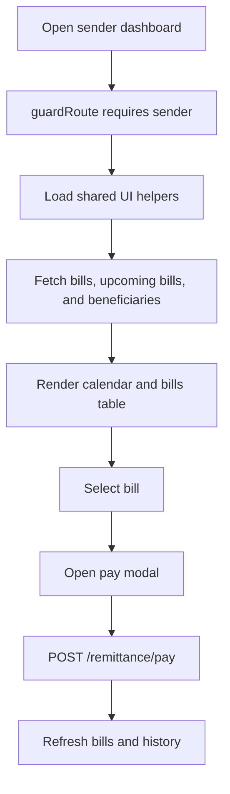
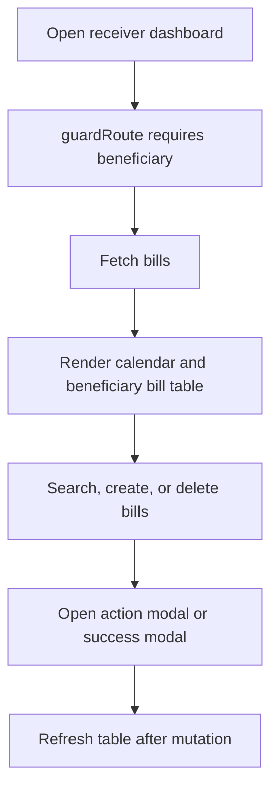

# Frontend Flow Digrams

## Login Flow

## Sender Dashboard Flow

## Receiver Dashboard Flow

## Notes
Keep the diagrams tied to the actual page scripts, especially when the sender and receiver dashboards diverge.