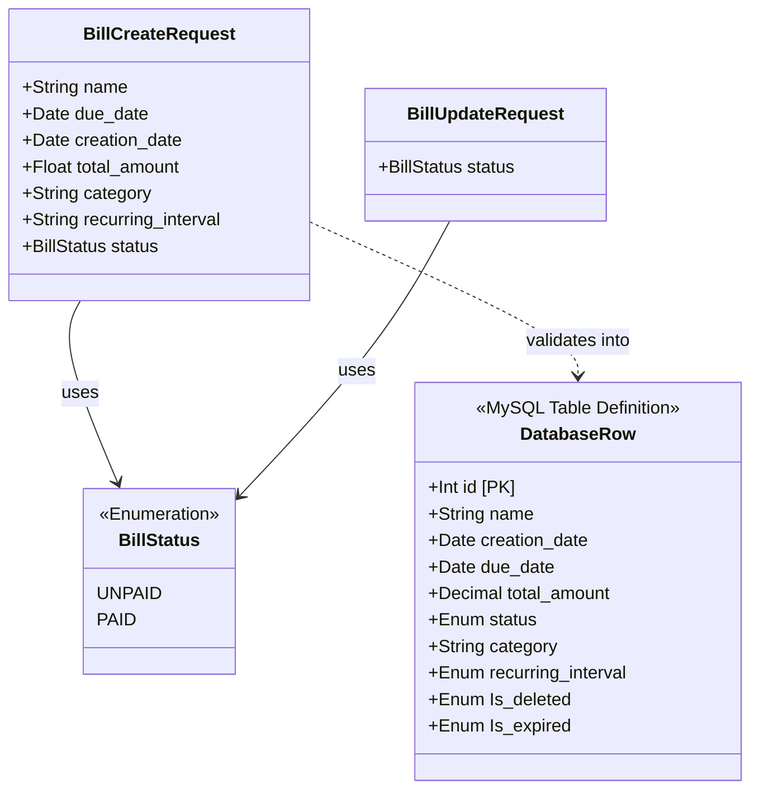

# Class and Object Diagrams

This document illustrates the data structures and runtime objects within the
Family Support Scheduler, focusing on the backend schemas and frontend state.

## 1. Class Diagram (Backend Schemas & Models)

The backend utilizes Pydantic models for data validation rather than traditional
Object-Oriented classes. This diagram shows the structural relationship between
the incoming data payloads and the internal Database schema representation.



## 2. Object Diagram (Frontend Runtime State)

This diagram represents a snapshot of the frontend's memory at a specific
point in time (e.g., after the dashboard has loaded and fetched data).

```mermaid
objectDiagram
    object state {
        selectedDate = "2026-04-30"
        selectedBill = bill_1
        currentMonth = 4
        currentYear = 2026
        projectionCount = 12
    }

    object bill_1 {
        id = 1
        name = "Electric Bill"
        status = "UNPAID"
        due_date = "2026-05-02"
        recurring_interval = "MONTHLY"
    }

    object bill_2 {
        id = 2
        name = "Internet"
        status = "PAID"
        due_date = "2026-04-15"
        recurring_interval = "NONE"
    }

    object projected_bill_3 {
        <<Virtual Object>>
        id = "proj_1_1"
        name = "Electric Bill"
        status = "UNPAID"
        due_date = "2026-06-02"
        recurring_interval = "MONTHLY"
    }

    state *-- bill_1
    state *-- bill_2
    state *-- projected_bill_3 : contains
    projected_bill_3 ..> bill_1 : generated from
```

### Explanation
- **Virtual Objects**: The `projected_bill_3` is an object that exists purely in the frontend's RAM. It is generated by the `utils.js` projection engine based on `bill_1`'s recurring interval. It does not possess a real integer database ID, but rather a synthetic string ID used for rendering.
