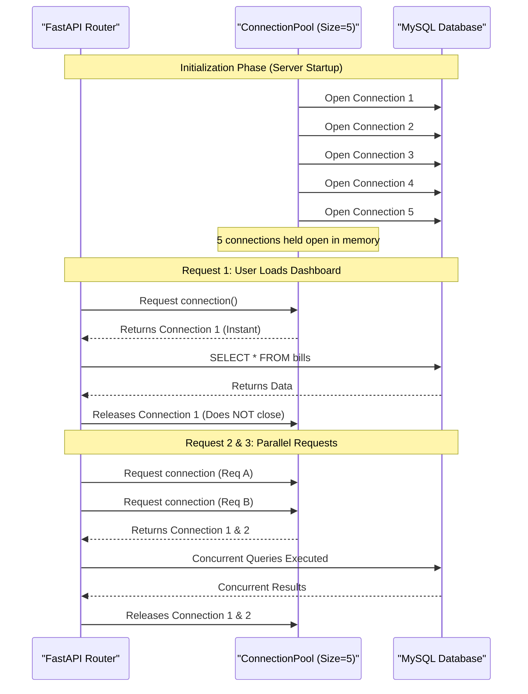

# Database Connection Pooling

This schematic demonstrates how connection pooling protects the MySQL database
from connection exhaustion and reduces query latency.

## Connection Lifecycle Diagram

### Why Pooling Helps
1. **TCP Overhead Elimination**: A standard `mysql.connector.connect()` call requires establishing a new TCP handshake and authenticating credentials. Pooling performs this expensive operation once at server startup.
2. **Concurrency Management**: If 10 users click "Add Bill" at the exact same millisecond, the connection pool prevents the database from being flooded with 10 simultaneous connection requests. It acts as a throttle, utilizing the 5 available connections and queueing the rest, preventing `Too many connections` crashes.
