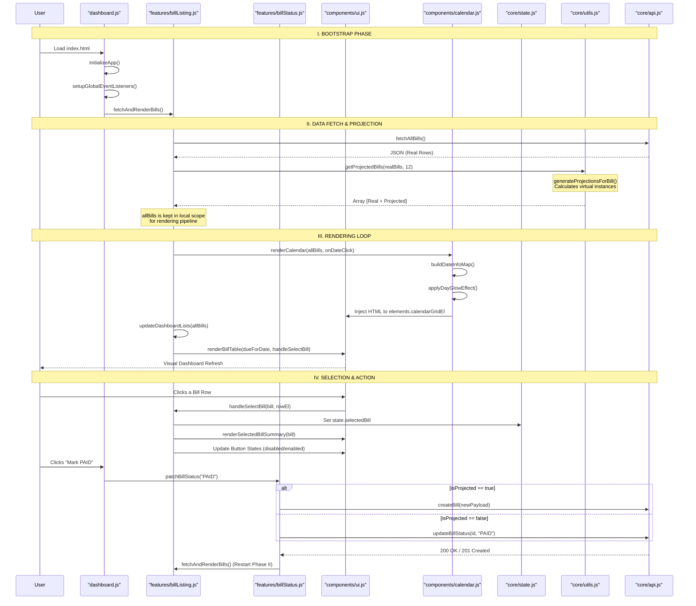

# Frontend Rendering & Logic Flow (Detailed Schematic)

This document provides a comprehensive mapping of the frontend subsystem, detailing the sequential flow of execution, module responsibilities, and specific function signatures.

## 1. Module Hierarchy & Responsibilities

| Layer | Responsibility | Key Files |
| :--- | :--- | :--- |
| **Entry Point** | Application bootstrap and event orchestration. | `dashboard.js` |
| **Features** | Business logic for specific actions (CRUD, Search). | `features/*.js` |
| **Components** | UI rendering engines and DOM element registry. | `components/*.js` |
| **Core** | Shared state, API client, and mathematical utils. | `core/*.js` |

---

## 2. Detailed Interaction Sequence

---

## 3. Comprehensive Function Reference

### Entry Point: `dashboard.js`
- **`initializeApp()`**: Entry point. Sets default dates, wires events, and triggers first fetch.
- **`setupGlobalEventListeners()`**: Attaches logic from `features/` to DOM IDs found in `ui.js`.

### Features Layer (`features/`)
- **`billListing.js`**
    - `fetchAndRenderBills()`: Orchestrates the API -> Projection -> Calendar flow.
    - `handleSelectBill(bill, rowEl)`: Updates selection state and enables/disables UI buttons.
    - `updateDashboardLists(allBills)`: Filters bills by selected date and renders sidebars.
- **`billStatus.js`**
    - `patchBillStatus(newStatus)`: Detects if a bill is projected (virtual) and either calls `POST` or `PUT`.
- **`billCreation.js`**
    - `handleCreateBillSubmit(event)`: Extracts form data and calls `API.createBill`.
- **`billDeletion.js`**
    - `handleOpenDeleteConfirmation()`: Populates the delete modal with selected bill details.
    - `handleConfirmDelete()`: Calls `API.deleteBillById`.
- **`billSearch.js`**
    - `handleSearchSubmit()`: Queries the backend via `API.searchBills` and renders a result table.

### Components Layer (`components/`)
- **`ui.js`**
    - `elements`: Registry of all interactive DOM elements (mapped by ID).
    - `renderBillTable()`: Higher-order function for generating dynamic tables.
    - `displayStatusMessage(msg)`: Updates the centralized terminal-style status bar.
- **`calendar.js`**
    - `renderCalendar()`: The main engine for drawing the month grid and padding.
    - `applyDayGlowEffect()`: Logic for assigning CSS classes (`glow`, `glow-paid`, `glow-expired`).
    - `handleMonthChange(delta)`: Updates state and re-fetches for navigation.
- **`modal.js`**
    - `handleOpenCreateModal()` / `handleCloseCreateModal()`: Visibility toggles.
    - `setDueDateDefaults()`: Logic for setting "Today + 3 days" on the creation form.

### Core Layer (`core/`)
- **`api.js`**: Native `fetch` wrappers for all `/bills` endpoints.
- **`utils.js`**:
    - `getProjectedBills()`: Core logic for generating virtual recurring instances.
    - `getDaysUntilDue()`: Date arithmetic for status logic.
- **`state.js`**: Single mutable object holding the current application context.
