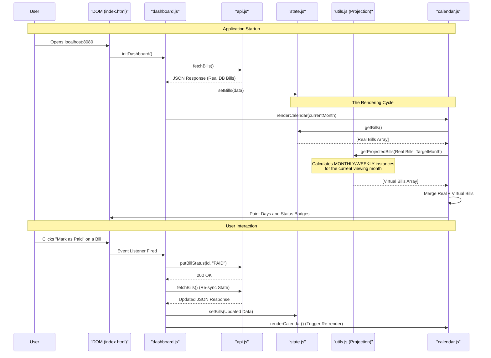

# Frontend Rendering & Logic Flow

This schematic details how the vanilla JavaScript frontend orchestrates data
fetching, state management, recurrence projections, and DOM updates.

## Interaction Flow Diagram

### Why This Architecture?
By centralizing state and treating the DOM purely as a reflection of that state, the application avoids "DOM-spaghetti." The calendar script doesn't know where the bills come from; it simply asks the state manager. The projection engine operates dynamically so the database never needs to store thousands of future recurring bills, saving massive amounts of disk space.
