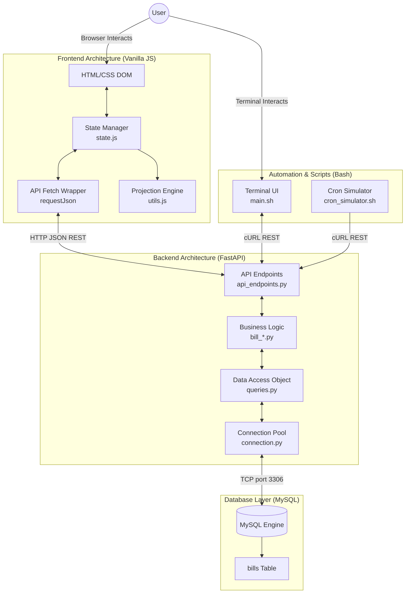

# Full Stack Architecture

This document illustrates the high-level system architecture and the full-stack
approach used by the Family Support Scheduler.

## System Level Architecture Diagram

### Flow Explanation
1. **User Interaction**: The user can interact with the system via the browser UI or the terminal CLI.
2. **Frontend State**: The Vanilla JS frontend manages state centrally and calculates future recurring bills on-the-fly using the projection engine.
3. **Backend Routing**: FastAPI handles incoming HTTP requests from both the browser and the automation scripts.
4. **Service Isolation**: The backend relies heavily on service layers to separate HTTP routing from database operations.
5. **Persistence**: MySQL handles data persistence, accessed exclusively via a pooled connection manager.
